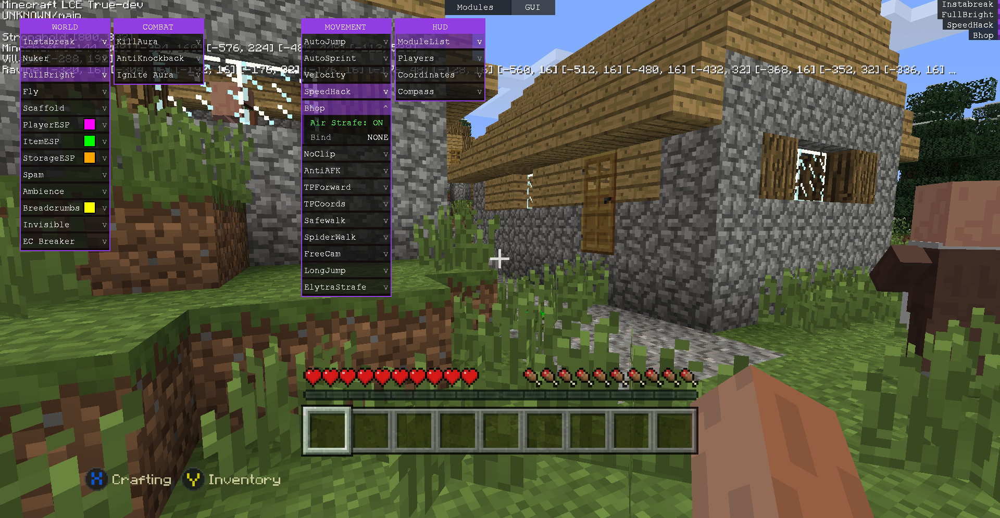
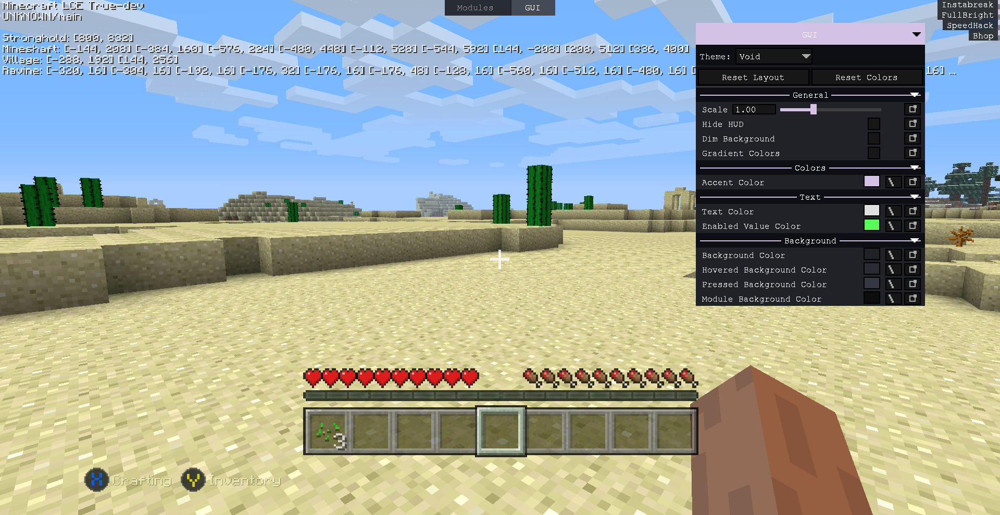

  

# Void
**Cheat Client for Minecraft Legacy Console Edition**

---

## Screenshots

  
  

---

## Features

**World**
- Instabreak — instant block breaking regardless of tool or gamemode
- Nuker — breaks all blocks in a configurable radius
- FullBright — removes all lighting calculations, full visibility everywhere
- Fly — creative flight in survival
- Scaffold — automatically places blocks under your feet while walking
  - Auto Select, Place Items, Build Over sub-options
- Invisible — makes your player invisible - Client Sided
- EC Breaker — destroys ender chests without a pickaxe
- Breadcrumbs — draws a colored trail of your movement path
- Ambience — visual environment tweaks (End Sky, No Fog)

**ESP**
- PlayerESP — colored boxes and tracers on other players; configurable color, range, show name, show distance, tracer, rainbow mode
- ItemESP — highlights dropped items on the ground; configurable color, show name, tracer, rainbow mode
- StorageESP — highlights chests, furnaces, barrels and other containers; configurable color, show name, range

**Combat**
- KillAura — auto-attacks all nearby players regardless of range
- AntiKnockback — cancels incoming knockback
- Ignite Aura — sets nearby tnt on fire

**Movement**
- Fly — survival flight
- AutoJump — automatically jumps when a block is in the player path while moving forward
- AutoSprint — always sprints
- Velocity — raw velocity multiplier (configurable) - Unstable
- SpeedHack — walk-speed boost (configurable factor)
- Bhop — bunny hop with optional Neverlose style air strafe
- NoClip — fly through blocks (configurable speed) - Unstable
- FreeCam — detach camera from player body
- Safewalk — prevents walking off edges
- SpiderWalk — walk up vertical surfaces
- LongJump — increases jump distance (configurable power)
- ElytraStrafe — mimicks elytra flight (configurable speed and hold key)
- TPForward — teleports the player forward a configurable distance
- TPCoords — teleports to exact X/Y/Z coordinates
- AntiAFK — prevents AFK kick by simulating minor movement

**HUD**
- ModuleList — waterfall sidebar listing all active modules
- Players — live player list with optional server IPs and XYZ coordinates
- Coordinates — displays current player XYZ on screen
- Compass — on-screen directional compass

**Spam**
- Spam — sends a configurable message in chat at a set interval (configurable delay)

---

## Installation

1. Download the latest release binary from the [Releases](../../releases) page.
2. Extract and run `Minecraft.exe`.
3. Press **Insert** in-game to open the mod menu.

---

## Requirements

- Windows 10 / 11 (x64)
- Visual C++ Redistributable 2022 (x64)
- DirectX 11

---

## Notes

- Singleplayer and multiplayer both supported.
- All module keybinds are configurable inside the GUI.
- This is a free release. Reselling or redistributing is prohibited.

---

## Support

Void is and will always be free. If you want to support continued development:

---

## Star History

  

---

## License

Source code is not public. The compiled binary is provided as-is for personal use only.
